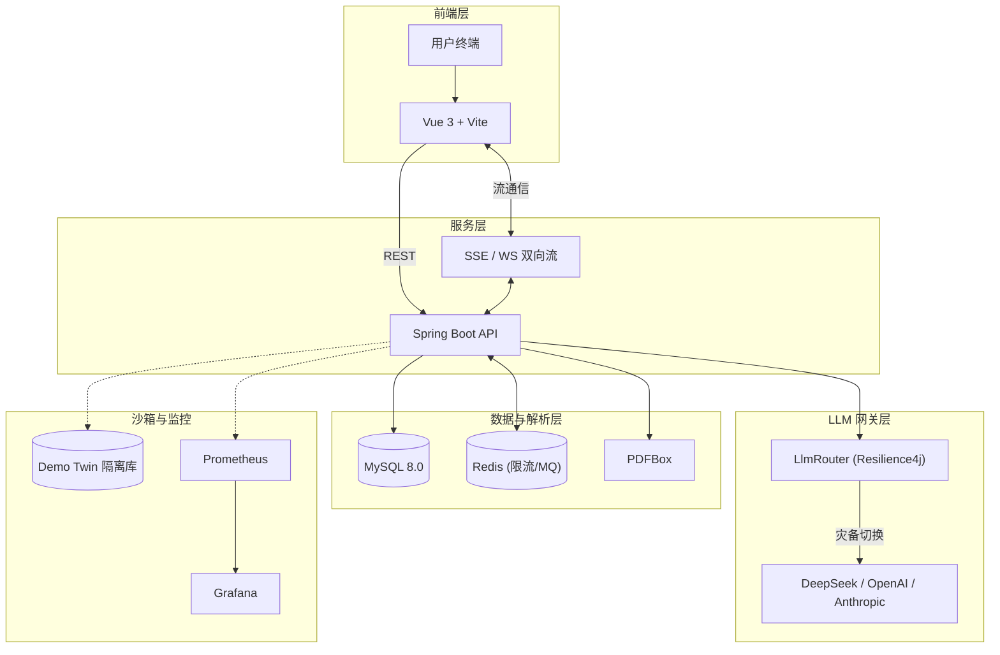
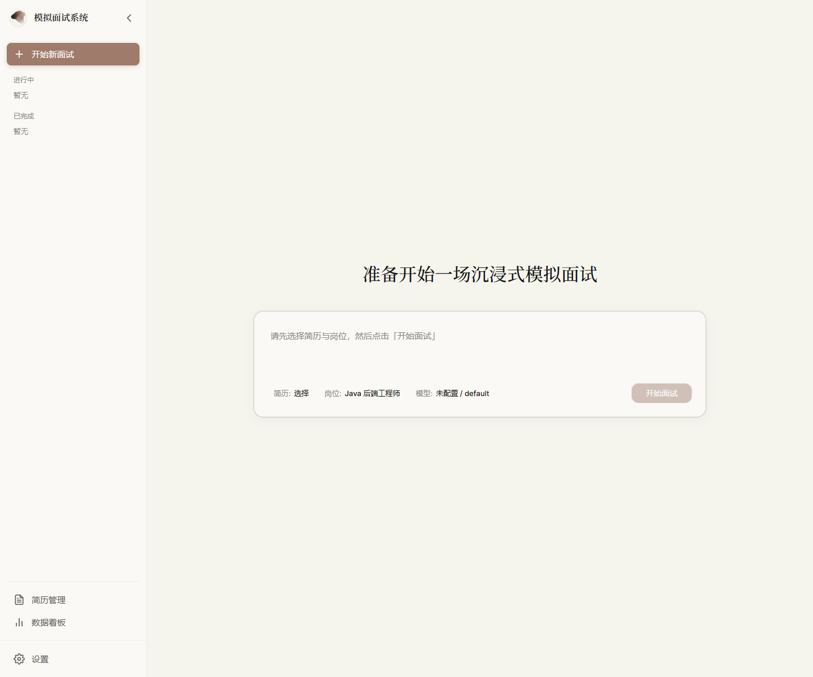
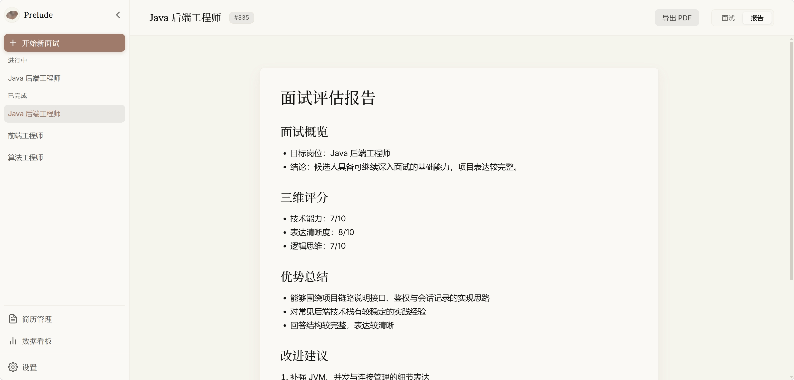

<div align="center">
  

# Prelude

*一款支持简历诊断与流式语音交互的沉浸式模拟面试平台*

    
<br>
   
</div>

---

## 核心能力

- PDF 简历解析、岗位模板匹配、阶段化模拟面试与 Markdown 评估报告
- SSE 指数退避重连 + Resilience4j 熔断降级，保障 LLM 调用高可用
- Voice-to-Voice 流式低延迟语音对话（首字节 < 3s）
- 用户级 LLM Provider 配置（DeepSeek / OpenAI / Anthropic Claude），API Key AES-256-GCM 加密
- 能力雷达图、评分趋势和薄弱点统计，面试到复盘闭环
- Demo Twin 演示模式：数据库、端口、前端环境与真实模式完全隔离

## 系统架构



## 快速开始

### 环境要求

| 组件 | 版本 | 备注 |
|------|------|------|
| Windows | 11 | PowerShell 7+ 推荐 |
| Java | 21 | |
| Maven | 3.9+ | |
| Node.js | 24 | npm 11.6.0 |
| MySQL | 8.0 | 需手动启动 |
| Redis | 7.0 | 需手动启动 |

### 启动真实版

1. 复制后端配置：`Copy-Item .\backend\src\main\resources\application-local.example.yml .\backend\src\main\resources\application-local.yml`
2. 编辑 `application-local.yml`，填写 MySQL 密码、JWT secret、AES secret 和模型 Key（最小 4 个字段）
3. 建库：`mysql -uroot -p -e "CREATE DATABASE IF NOT EXISTS interview_system DEFAULT CHARACTER SET utf8mb4 COLLATE utf8mb4_unicode_ci;"`
4. 启动：`.\start-real.bat`
5. 访问：前端 `http://127.0.0.1:5173`，后端 `http://127.0.0.1:8080`，健康检查 `/api/health`

> 完整配置模板与字段说明见 [docs/setup.md](docs/setup.md)。

### 启动 Demo Twin

1. 建库：`mysql -uroot -p -e "CREATE DATABASE IF NOT EXISTS interview_demo DEFAULT CHARACTER SET utf8mb4 COLLATE utf8mb4_unicode_ci;"`
2. 启动：`.\start-demo.bat`
3. 登录：`demo / 123456`

> Demo 截图脚本、重置命令与输出路径见 [docs/demo.md](docs/demo.md)。

## 技术栈

| 层 | 技术 |
|----|------|
| 后端 | Java 21、Spring Boot 3.2、MyBatis-Plus、MySQL 8.0、Redis、WebSocket、Resilience4j、PDFBox、OkHttp、JWT、BCrypt、AES-256-GCM |
| 前端 | Vue 3、TypeScript、Vite、Element Plus、Vue Router、Pinia、Axios、markdown-it、ECharts |
| 模型 | DeepSeek API、OpenAI 兼容协议、Anthropic Claude API |
| 流式 | Spring SseEmitter + 前端 fetch / ReadableStream |
| 运维 | Docker Compose、Prometheus & Grafana |

## 项目结构

```text
E:\Prelude
├── README.md
├── docs/                      # 公开文档、接口说明与截图
├── backend/                   # Spring Boot 后端
├── frontend/                  # Vue 前端
├── scripts/                   # 启动、重置和截图脚本
├── thesis-assets/             # 论文材料、交付物与答辩资产
├── thesis-handbook/           # 毕设流程手册与协作提示词
├── start-real.bat             # 真实版启动入口
└── start-demo.bat             # Demo Twin 启动入口
```

## 页面与路由

| 路径 | 说明 |
|------|------|
| `/login` | 登录 / 注册 |
| `/interview` | 主工作台（面试对话、报告预览） |
| `/resumes` | 简历管理 |
| `/analytics` | 数据看板（能力雷达、评分趋势） |

LLM 配置与用户设置已整合至全局设置弹窗（齿轮图标触发）。

### 界面预览

<div align="center">
  
  <br><br>
  
</div>

## API

完整接口说明见 [docs/api.md](docs/api.md)。

## CI

仓库包含 GitHub Actions 工作流（`.github/workflows/ci.yml`），在 Windows runner 上执行后端编译/测试与前端构建。

## 常见问题

- 真实版不会自动插入 `demo / 123456` 用户；Demo 用户只在 Demo profile 下加载。
- JWT secret 和 AES secret 必须通过本地配置或环境变量提供，避免误用默认密钥。
- 启动脚本不会自动启动 MySQL 和 Redis，需手动启动。
- CORS 允许源由 `app.cors.allowed-origins` 配置驱动，部署到其他地址时调整配置即可。
