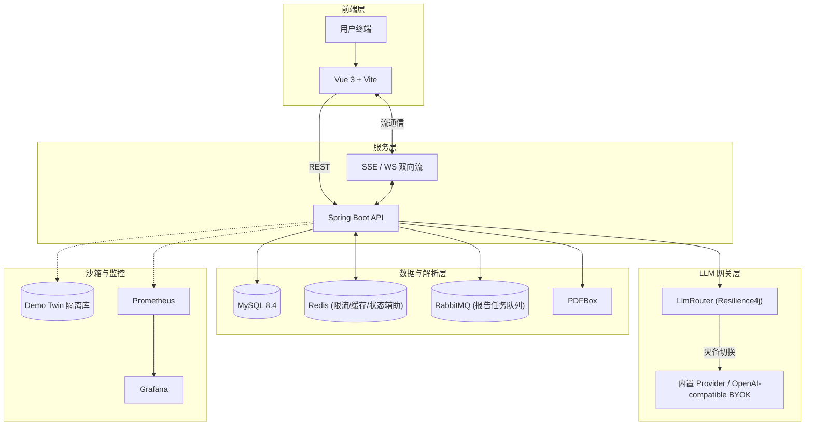

<div align="center">
  

# Prelude

_一款支持简历诊断与流式语音交互的沉浸式模拟面试平台_

    
<br>
   

</div>

---

## 核心能力

- PDF 简历解析、岗位模板匹配、阶段化模拟面试与 Markdown 评估报告
- SSE 指数退避重连 + Resilience4j 熔断降级，提升 LLM 调用链路韧性
- 语音链路基础架构与 WebSocket 通道已搭建，真实低延迟表现仍需专项验证
- 用户级 LLM Provider 配置与 OpenAI-compatible BYOK，自定义 endpoint / API Key / 运行模型，API Key AES-256-GCM 加密
- 能力雷达图、评分趋势和薄弱点统计，面试到复盘闭环
- Demo Twin 演示模式：数据库、端口、前端环境与真实模式完全隔离

## 系统架构



## 快速开始

### 环境要求

| 组件    | 版本 | 备注                                  |
| :------ | :--: | :------------------------------------ |
| Windows |  11  | PowerShell 7+ 推荐                    |
| Docker  | Desktop | 默认运行方式（含 Compose v2）      |

默认运行方式为 **Docker Compose 全栈**，无需本机安装 Java / Maven / Node / MySQL / Redis / RabbitMQ。仅在源码级调试时才需要它们（见 [Dev local runtime](docs/runtime-modes.md#dev-local-runtime)）。

运行模式边界见 [docs/runtime-modes.md](docs/runtime-modes.md)。

### 启动真实版（Docker，默认）

1. 准备环境变量：`Copy-Item .\.env.example .\.env`
2. 按需编辑 `.env`（`JWT_SECRET`、`APP_CRYPTO_AES_SECRET` 至少 32 字节；模型可用前端 BYOK 设置页配置）
3. 启动：`.\start-real.bat`
4. 访问：前端 `http://127.0.0.1:5173`，后端 `http://127.0.0.1:8080`，健康检查 `/api/health`

> 完整配置模板与字段说明见 [docs/setup.md](docs/setup.md)。

### 启动 Demo Twin（Docker，默认）

1. 准备环境变量（如未做过）：`Copy-Item .\.env.example .\.env`
2. 启动：`.\start-demo.bat`
3. 登录：`demo / 123456`

> Demo 截图脚本、重置命令与输出路径见 [docs/demo.md](docs/demo.md)。

### 停止服务

real 与 demo 共享同一组基础中间件（mysql/redis/rabbitmq）。并行运行时停单一 profile 会连带停掉共享中间件，按需选择：

```powershell
docker compose stop backend-real frontend-real      # 仅停真实版应用层
docker compose stop backend-demo frontend-demo      # 仅停 Demo 应用层
docker compose stop prometheus grafana              # 仅停观测栈
docker compose --profile real --profile demo down   # 停全部 + 共享中间件
docker compose --profile real --profile demo --profile observability down  # 含观测栈
```

## 技术栈

- **后端**：`Java 21` `Spring Boot 3.2` `MyBatis-Plus` `MySQL 8.4` `Redis` `RabbitMQ` `WebSocket` `Resilience4j` `PDFBox` `OkHttp` `JWT` `BCrypt` `AES-256-GCM`
- **前端**：`Vue 3` `TypeScript` `Vite` `shadcn-vue` `Tailwind CSS` `Vue Router` `Pinia` `Axios` `markdown-it` `ECharts`
- **模型**：内置 Provider 配置 + `OpenAI-compatible BYOK` 自定义接口
- **流式**：`Spring SseEmitter` `前端 fetch / ReadableStream`
- **运维**：`Docker Compose` `Prometheus & Grafana`

## 项目结构

```text
E:\Prelude
├── README.md
├── docs/                      # 公开文档、接口说明与截图
├── backend/                   # Spring Boot 后端
├── frontend/                  # Vue 前端
├── scripts/                   # dev mode 本机启动、重置和截图脚本
├── thesis-assets/             # 论文材料、交付物与答辩资产
├── thesis-handbook/           # 毕设流程手册与协作提示词
├── start-real.bat             # 真实版 Docker 启动入口（默认）
└── start-demo.bat             # Demo Twin Docker 启动入口（默认）
```

## 页面与路由

| 路径                   | 说明                           |
| :--------------------- | :----------------------------- |
| <kbd>/login</kbd>      | 登录 / 注册                    |
| <kbd>/interview</kbd>  | 主工作台（面试对话、报告预览） |
| <kbd>/resumes</kbd>    | 简历管理                       |
| <kbd>/analytics</kbd>  | 数据看板（能力雷达、评分趋势） |

LLM 配置与用户设置已整合至全局设置弹窗（齿轮图标触发）。

### 界面预览

<div align="center">
  
  <br><br>
  
  <br><br>
  
  <br><br>
  
  <br><br>
  
  <br><br>
  
</div>

## API

完整接口说明见 [docs/api.md](docs/api.md)。

## CI

仓库包含 GitHub Actions 工作流（`.github/workflows/ci.yml`），在 Windows runner 上执行后端编译/测试与前端构建。

## 常见问题

- 真实版不会自动插入 `demo / 123456` 用户；Demo 用户只在 Demo profile 下加载。
- JWT secret 和 AES secret 必须通过 `.env`（Docker runtime）或 `application-local.yml`（dev mode）提供，避免误用默认占位密钥。
- Docker runtime 是默认运行方式，`start-real.bat` / `start-demo.bat` 执行 `docker compose --profile up -d --build`，不依赖本机 MySQL84 / 3306 / Redis / RabbitMQ 服务。dev local runtime（本机 Maven/Vite 调试）见 [docs/runtime-modes.md](docs/runtime-modes.md#dev-local-runtime)。
- 宿主机访问中间件默认端口已避开本机原生端口：MySQL `13306`、Redis `16379`、RabbitMQ `5672`/`15672`，可用 `.env` 覆盖。
- CORS 允许源由 `app.cors.allowed-origins` 配置驱动，部署到其他地址时调整配置即可。
