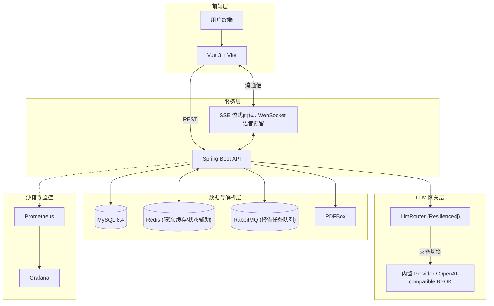
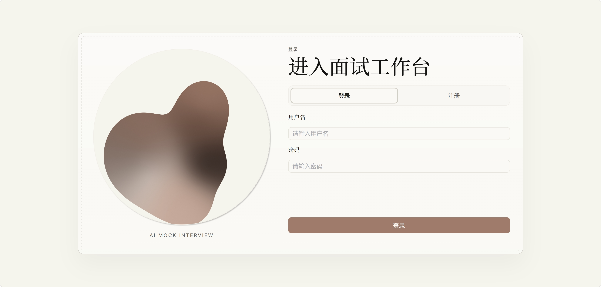
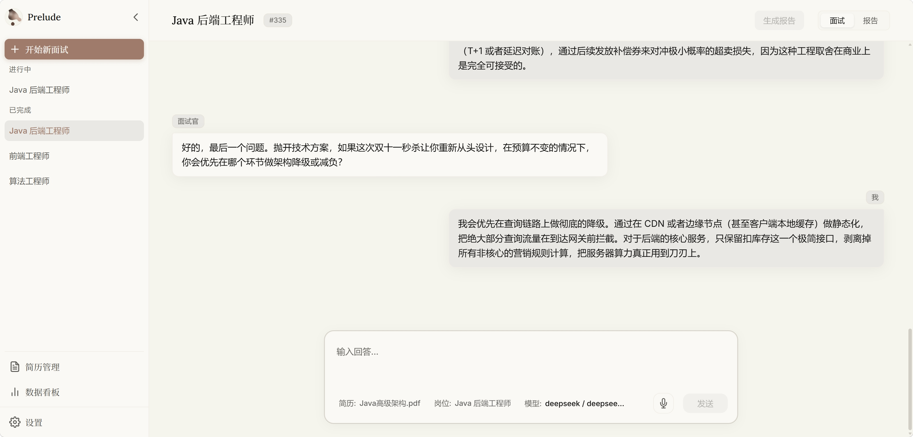
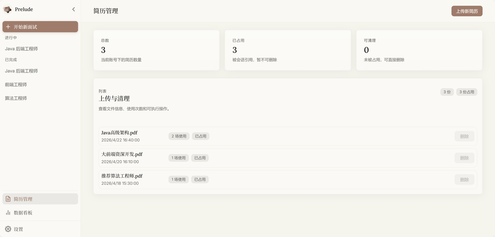
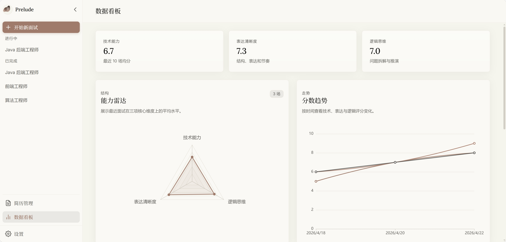

<div align="center">
  

# Prelude

_一款支持简历诊断、流式面试和语音链路预留的模拟面试平台_

     [](LICENSE)
<br>
   

</div>

---

## 核心能力

- PDF 简历解析、岗位模板匹配、阶段化模拟面试与 Markdown 评估报告
- SSE 指数退避重连 + Resilience4j 熔断降级，提升 LLM 调用链路韧性
- 语音链路基础架构与 WebSocket 通道已搭建，真实低延迟表现仍需专项验证
- 用户级 LLM Provider 配置与 OpenAI-compatible BYOK，自定义 endpoint / API Key / 运行模型，API Key AES-256-GCM 加密
- 能力雷达图、评分趋势和薄弱点统计，面试到复盘闭环

## 系统架构



## 快速开始

### 环境要求

| 组件 | 版本 | 备注 |
| :-- | :-: | :-- |
| Windows | 11 | PowerShell 7+ 推荐 |
| Docker | Desktop | 用于运行基础中间件 |

### 启动入口

- **推荐**：`.\start-dev.bat`（开发、人工验收、答辩演示；Vite HMR 可用）
- **可选**：`.\start-docker.bat`（Full Docker / 部署验证）

环境配置见 [docs/setup.md](docs/setup.md)，运行模式差异见 [docs/runtime-modes.md](docs/runtime-modes.md)。

### 常用地址

| 服务 | 地址 |
| :-- | :-- |
| 前端 | `http://127.0.0.1:5173` |
| 后端健康检查 | `http://127.0.0.1:8080/api/health` |
| RabbitMQ 管理台 | `http://127.0.0.1:15672` |

本地验收账号 `demo / 123456` 来自 `data-dev.sql` 与 dev fixture 链路，仅用于 local/dev。

## 技术栈

- **后端**：`Java 21` `Spring Boot 3.2` `MyBatis-Plus` `MySQL 8.4` `Redis` `RabbitMQ` `WebSocket` `Resilience4j` `PDFBox` `OkHttp` `JWT` `BCrypt` `AES-256-GCM`
- **前端**：`Vue 3` `TypeScript` `Vite` `shadcn-vue` `Tailwind CSS` `Vue Router` `Pinia` `Axios` `markdown-it` `ECharts`
- **模型**：内置 Provider 配置 + `OpenAI-compatible BYOK` 自定义接口
- **流式**：`Spring SseEmitter` `前端 fetch / ReadableStream`
- **运维**：`Docker Compose` `Prometheus & Grafana`

## 项目结构

```text
E:\Prelude
├── README.md
├── DESIGN.md                  # UI 设计规范与样式维护基线
├── docs/                      # 公开文档、接口说明与截图
├── backend/                   # Spring Boot 后端
├── frontend/                  # Vue 前端
├── scripts/                   # dev mode 本机启动、重置和截图脚本
├── thesis-assets/             # 论文材料、证据、交付物与答辩资产
├── output/                    # dev 截图、验证产物与可复现输出记录
├── start-dev.bat              # 开发与人工验收入口（含 Vite HMR）
├── start-docker.bat           # Full Docker / 部署验证入口
```

## 页面与路由

| 路径                   | 说明                           |
| :--------------------- | :----------------------------- |
| <kbd>/login</kbd>      | 登录 / 注册                    |
| <kbd>/interview</kbd>  | 主工作台（面试对话、报告预览） |
| <kbd>/resumes</kbd>    | 简历管理                       |
| <kbd>/analytics</kbd>  | 数据看板（能力雷达、评分趋势） |

LLM 配置与用户设置已整合至全局设置弹窗（齿轮图标触发）。

### 界面预览

<div align="center">
  
  <br><br>
  
  <br><br>
  
  <br><br>
  
  <br><br>
  
  <br><br>
  
</div>

## API

完整接口说明见 [docs/api.md](docs/api.md)。

## CI

仓库包含 GitHub Actions 工作流（`.github/workflows/ci.yml`），在 Windows runner 上执行后端编译/测试、前端构建与 UI 质量门禁。详见 [docs/quality/ui-quality-system.md](docs/quality/ui-quality-system.md) 与 [docs/quality/local-review-checklist.md](docs/quality/local-review-checklist.md)。

## 关键文档

- 设计与样式：[DESIGN.md](DESIGN.md)
- 运行入口：[docs/runtime-modes.md](docs/runtime-modes.md)
- 本地配置：[docs/setup.md](docs/setup.md)
- UI 自动化质量体系：[docs/quality/ui-quality-system.md](docs/quality/ui-quality-system.md)
- 工程风险台账：[docs/quality/risk-register.md](docs/quality/risk-register.md)
- Agent 协议：[AGENTS.md](AGENTS.md)
- 论文资产索引：[thesis-assets/README.md](thesis-assets/README.md)

## 常见问题

- `demo / 123456` 是 dev test account，只由 local/dev 的 `data-dev.sql` 和 dev fixture 链路使用。
- JWT secret 和 AES secret 必须通过 `.env`（Docker runtime）或 `application-local.yml`（dev mode）提供，避免误用默认占位密钥。
- **中间件依赖**：不推荐使用本机 MySQL84、Redis 或 RabbitMQ 系统服务。Docker 中间件是所有运行模式的默认基础设施。
- CORS 允许源由 `app.cors.allowed-origins` 配置驱动，部署到其他地址时调整配置即可。

## License

This project is licensed under the MIT License. See [LICENSE](./LICENSE) for details.
