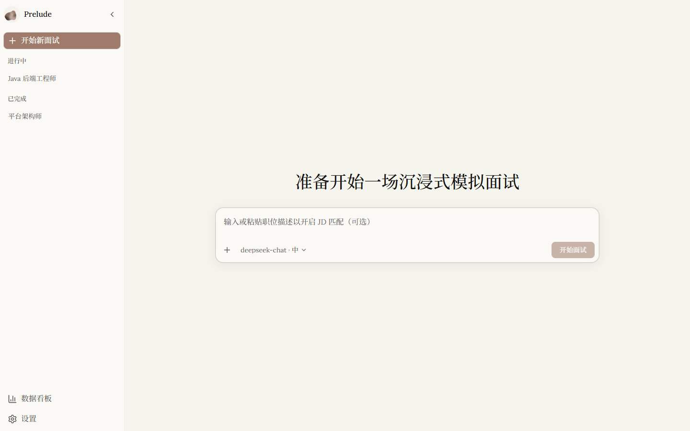
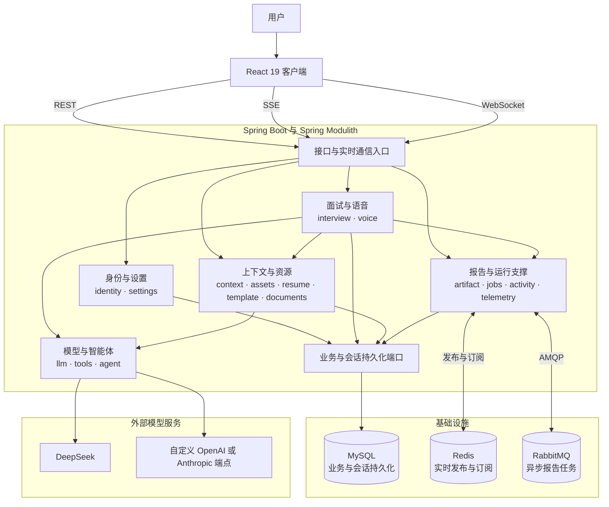
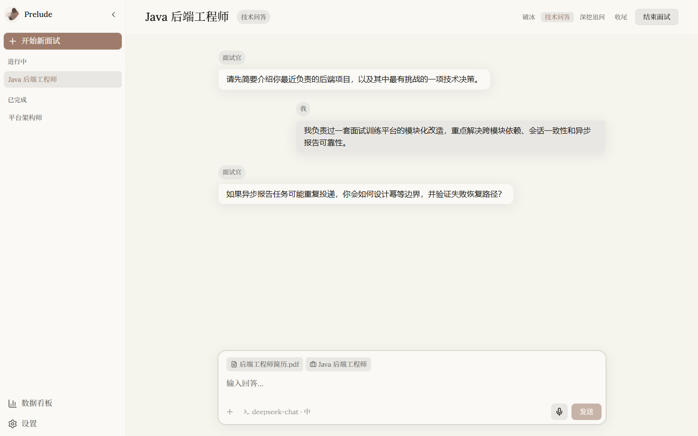
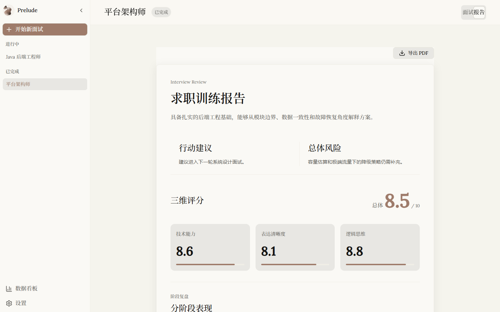
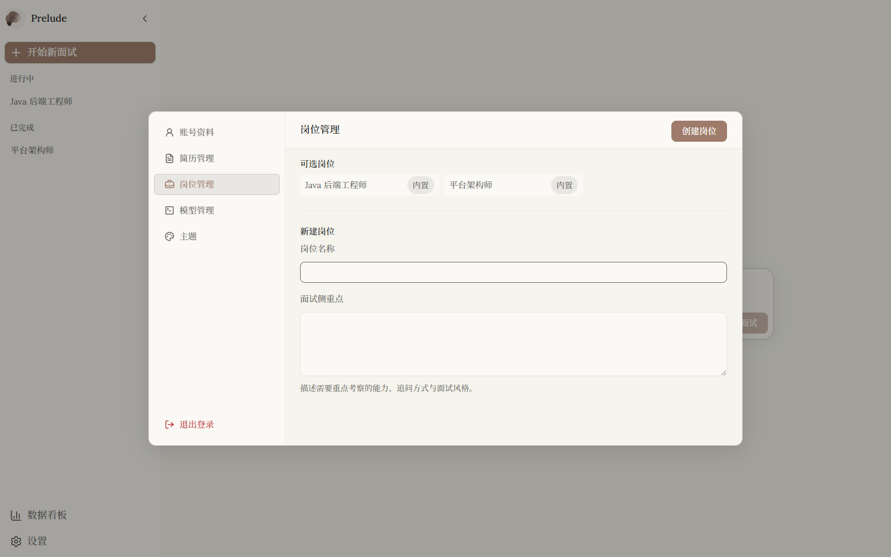
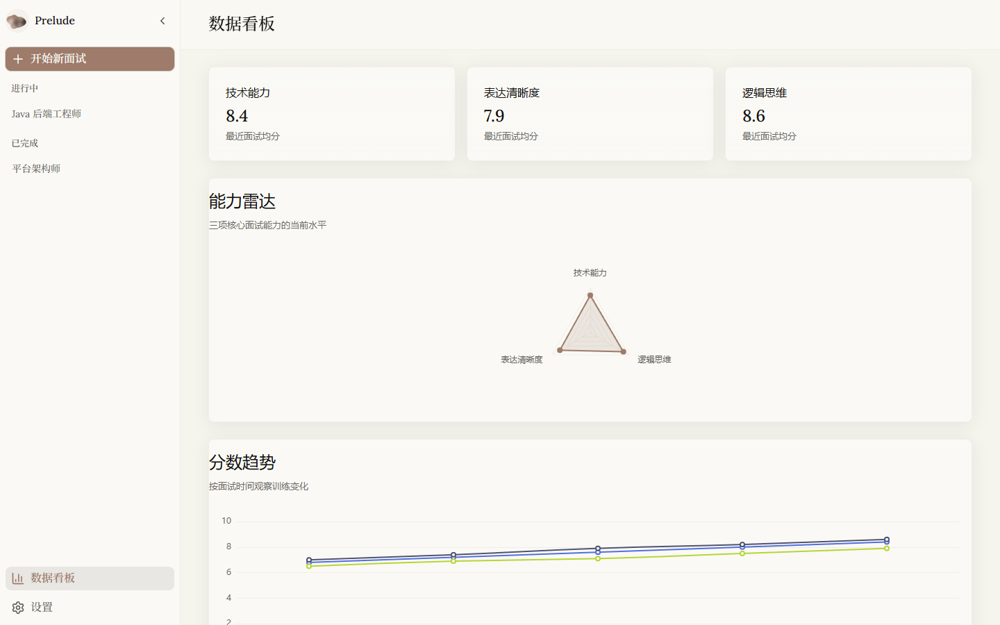

<div align="center">
  
  <h1>Prelude</h1>
  <p><strong>AI 模拟面试、训练评估与职业成长分析工作台</strong></p>
  <p>
    <a href="https://github.com/zyyyyynnn/Prelude/actions/workflows/ci.yml"></a>
    <a href="LICENSE"></a>
  </p>
  <p>
    
    
    
    
    
  </p>
  <p>
    
    
    
    
    
  </p>
</div>

## 项目概览

Prelude 以面试为核心，将面试准备、实时问答、结构化评估和训练分析组织在一个工作区中。简历、岗位、职位描述与通用附件作为面试上下文资源，为每场面试提供可控上下文，而不是独立的简历编辑工作流。

应用支持服务端会话、历史会话、文字与语音交互，以及按账号保存的自带密钥模型配置。当前仓库聚焦本地开发与可验证的模块化架构，不宣称公开托管或生产级软件即服务能力。

<p align="center">
  
</p>

## 核心能力

- 上下文面试准备：组合简历、岗位、职位描述与附件上下文。
- 文字与语音面试：提供流式文字回答与可安全释放资源的语音交互。
- 历史会话：浏览、置顶、隐藏和恢复历史面试会话。
- 结构化评估：生成并安全展示结构化训练报告。
- 训练分析：查看能力雷达、趋势和薄弱点。
- 自带密钥模型配置：配置 DeepSeek 或受支持的自定义模型协议。
- 账号与偏好：管理账号资料、主题和面试设置。

## 系统架构


```mermaid
flowchart TB
    U[用户] --> C[React 19 客户端]

    C -->|REST| G
    C -->|SSE| G
    C -->|WebSocket| G

    subgraph APP[Spring Boot 与 Spring Modulith]
        G[接口与实时通信入口]
        ID[身份与设置<br/>identity · settings]
        IV[面试与语音<br/>interview · voice]
        CR[上下文与资源<br/>context · assets · resume · template · documents]
        LM[模型与智能体<br/>llm · tools · agent]
        RJ[报告与运行支撑<br/>artifact · jobs · activity · telemetry]
        ST[业务与会话持久化端口]

        G --> ID
        G --> IV
        G --> CR
        G --> RJ
        IV --> CR
        IV --> LM
        IV --> RJ
        CR --> LM
        ID --> ST
        IV --> ST
        CR --> ST
        RJ --> ST
    end

    subgraph INFRA[基础设施]
        DB[(MySQL<br/>业务与会话持久化)]
        CACHE[(Redis<br/>实时发布与订阅)]
        MQ[(RabbitMQ<br/>异步报告任务)]
    end

    subgraph EXT[外部模型服务]
        DS[DeepSeek]
        CUSTOM[自定义 OpenAI 或 Anthropic 端点]
    end

    ST --> DB
    RJ <-->|发布与订阅| CACHE
    RJ <-->|AMQP| MQ
    LM --> DS
    LM --> CUSTOM
```

README 只展示系统职责分层；16 个应用模块的完整边界与依赖拓扑见[后端架构](docs/backend/architecture.md)。前端状态所有权与目录边界见[前端架构](docs/frontend/architecture.md)。

## 界面预览

| 实时面试 | 结构化评估 |
| :---: | :---: |
|  |  |
| 历史会话、当前问答与面试上下文 | 分阶段评分、复盘与训练建议 |

| 全局设置 | 训练分析 |
| :---: | :---: |
|  |  |
| 简历与岗位资源统一进入全局设置 | 能力雷达、分数趋势与薄弱点 |

## 技术栈

| 层级 | 技术 | 职责 |
| --- | --- | --- |
| 前端应用 | React 19、React Router、Base UI、Tailwind CSS、Vite | 路由与导航、交互语义、设计令牌和生产构建 |
| 服务端状态 | TanStack Query | 请求生命周期、缓存、失效与乐观更新 |
| 模块化后端 | Java 21、Spring Boot 4.1、Spring Modulith | 接口边界、模块化业务用例与依赖拓扑验证 |
| 模型与持久化 | Spring AI、MyBatis-Plus、Flyway | 模型协议接入、数据访问与数据库版本治理 |
| 数据与消息 | MySQL 8.4、Redis 7.4、RabbitMQ 4.1 | 业务和会话数据、实时广播与异步报告任务 |
| 本地运行 | Docker Compose | 本地基础设施与完整容器栈 |

shadcn/ui 与 Beautiful UI 仅提供已采用组件的源码结构或组合参考；本地源码、视觉语义与维护责任归 Prelude 所有。

## 快速开始

### 环境要求

- Windows 11 与 PowerShell 7+
- Java 21、Maven
- Node.js 22.22+、npm 12
- Docker Desktop

### 启动基础设施

```powershell
Copy-Item .env.example .env
docker compose up -d mysql redis rabbitmq
```

### 启动应用

分别在两个 PowerShell 窗口启动后端和前端：

```powershell
mvn -f backend/pom.xml spring-boot:run
```

```powershell
npm --prefix frontend ci
npm --prefix frontend run dev
```

默认访问 `http://127.0.0.1:5173`，后端健康检查位于 `http://127.0.0.1:8080/actuator/health`。Windows 下也可运行 `start-dev.bat` 启动本地应用，或运行 `start-docker.bat` 构建完整容器栈。

## 验证

```powershell
mvn -f backend/pom.xml clean test
npm --prefix frontend ci
npm --prefix frontend run check
npm --prefix frontend run build
npm --prefix frontend run test:smoke
```

CI 还会执行生产产物、自带密钥契约、暗色主题、可访问性、代表性视觉与运行时依赖审计。GitHub 仅以 `backend` 和 `frontend` 两个职责域作为必需检查项。

## 仓库结构

```text
backend/   Spring Modulith 后端、Flyway 数据库迁移与后端测试
frontend/  React 客户端、设计令牌、浏览器测试与第三方许可声明
docs/      环境、架构、质量体系与产品文档资产
.github/   CI 工作流与拉取请求模板
```

## 文档

| 文档 | 范围 |
| --- | --- |
| [本地开发](docs/setup.md) | 工具链、启动模式与完整验证命令 |
| [后端架构](docs/backend/architecture.md) | 应用模块、依赖边界与持久化规则 |
| [前端架构](docs/frontend/architecture.md) | React 目录、状态所有权与界面源码所有权 |
| [界面质量体系](docs/quality/ui-quality-system.md) | 设计令牌、主题、可访问性与视觉验证 |
| [设计规范](DESIGN.md) | Prelude 视觉与交互规范 |
| [贡献指南](CONTRIBUTING.md) | 分支、验证与拉取请求要求 |
| [安全策略](SECURITY.md) | 私密漏洞报告渠道与当前维护范围 |

## 许可证

Prelude 自有源码采用 [MIT License](LICENSE)。采用或打包的第三方源码与运行时组件保留各自条款；shadcn/ui、Beautiful UI 和 Paper Design Shaders 的分发许可声明位于 [frontend/public/licenses](frontend/public/licenses)。其中 Paper Design Shaders 使用 PolyForm Shield 1.0.0，不属于 Prelude 的 MIT 授权范围。
