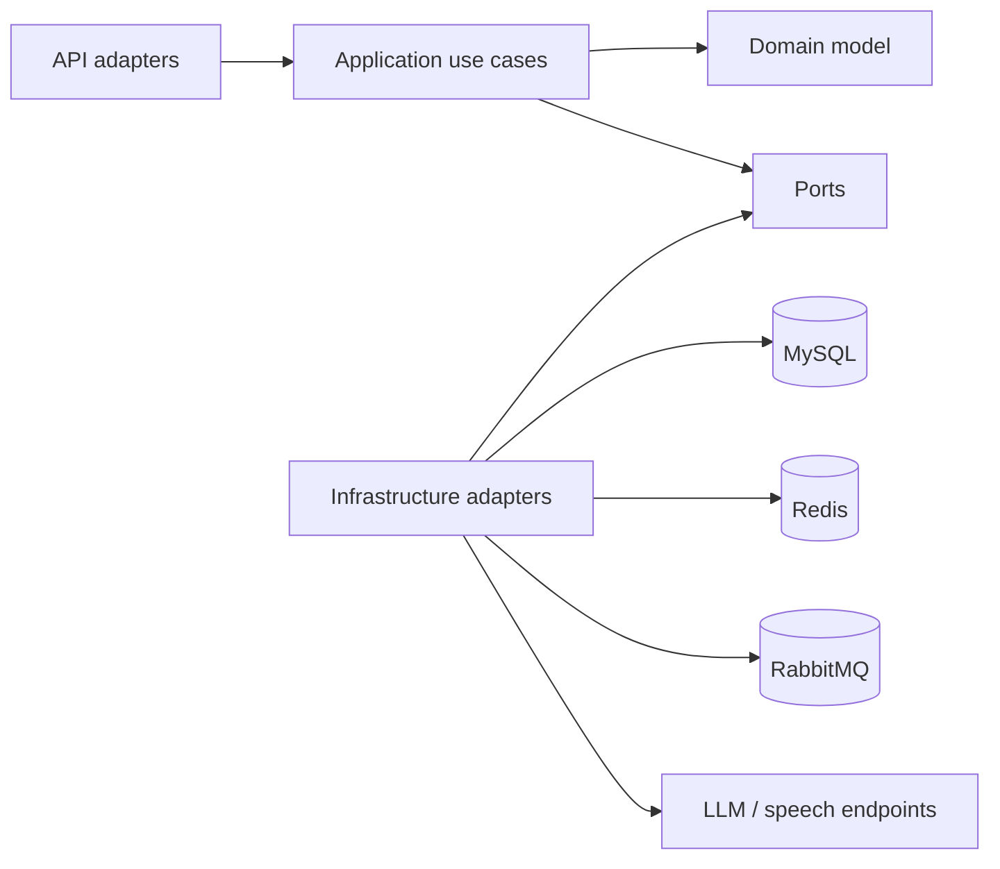

# Backend Architecture

Prelude 后端是单进程、单数据库的模块化单体。模块边界用于隔离业务职责和基础设施变化，不代表可独立部署的微服务。

## 模块

| 模块 | 所有权 |
| --- | --- |
| `identity` | 用户、认证、资料与凭证归属 |
| `resume` | PDF 导入、`ResumeDocument`、版本更新与简历改进建议 |
| `catalog` | 岗位模板目录 |
| `interview` | 会话、消息、阶段、文字/语音回合与结束面试用例 |
| `insight` | 报告生成、评分历史、薄弱点与分析查询 |
| `platform` | LLM、检索、作业、实时通知等技术能力与 Port 实现 |
| `shared` | 统一结果、业务异常和请求上下文等最小共享内核 |
| `bootstrap` | 应用启动与仅 local/dev 生效的 fixture 适配器 |

核心业务模块按 `api -> application -> domain` 方向调用，`infrastructure` 实现 application/domain 声明的 Port。domain 不依赖 Spring、MyBatis 或 Web 类型；application 不导入本模块持久化实现。

跨模块协作使用小型 Port、Command、Result 或 View。API DTO 只存在于协议适配层；公开 Port 可以位于模块的 `api/port`，但不得把 Controller DTO 传入 application。

## 核心链路

### 面试与报告

文字和语音适配器共享 `RunInterviewTurn`，因此会话、阶段、消息和评分真源一致。语音 TTS 经 `SessionKeyedSerialExecutor` 调度：同一 session 内 sentence 串行保序，不同 session 可并行（`prelude.voice.tts-pool-size`）。`FinishInterview` 只通过 `JobSchedulerPort` 创建报告作业；RabbitMQ worker 只把消息交给 `ReportGenerateHandler`。作业状态以 `async_job` 为真源：先写 PENDING 再投 MQ；发布失败保持 PENDING 并记录脱敏错误，由客户端重试或 `PendingJobRecoveryPublisher` 补投；原子 claim、有限重试、运行租约与启动后恢复吸收重复投递和进程中断。

实时事件经 `RealtimePort`：`prelude.realtime.mode=local`（默认）使用进程内 `LocalRealtimeHub`；`mode=redis` 使用 `RedisRealtimeHub` 在本地扇出后经 Redis pub/sub 跨实例广播。

报告生成通过 `InterviewReportPort` 读取面试数据，通过 `ResumeImprovementPort` 获取简历白名单字段并保存有证据的建议。接受建议属于 resume 用例：校验用户、建议状态、当前字段原文和简历版本后再提交事务。

### LLM 与 BYOK

`ChatPort`、`EmbedPort` 与 `LlmConfigPort` 隔离 application 和 Provider 实现。默认 DeepSeek 使用系统配置；OpenAI Responses、OpenAI Chat Completions 与 Anthropic Messages 使用用户级 Key，失败时不进入系统 Provider fallback。

自定义 endpoint 统一经过 `CustomLlmEgressPolicy` 与 `CustomLlmHttpClient`。生产默认只允许 HTTPS 443 公网地址，DNS 在保存和实际连接阶段重复校验，HTTP 重定向关闭，响应大小和超时受限。

### Retrieval

`RetrievalPort` 按 `scopeType + scopeId` 建立 chunk 快照。`retrieval_chunk` 保存内容哈希、embedding 模型版本、维度和向量；进程重启优先恢复当前模型的持久化向量，过期或缺失向量才重算。

搜索对完整候选集同时计算关键词与归一化余弦分数，避免强关键词结果被向量预筛丢弃。查询或单 chunk embedding 失败时保留关键词路径。当前实现仍是单实例内存扫描，规模提升或多实例 SLO 出现后再评估专用向量索引。

## 数据与运行

| 文件 | 职责 |
| --- | --- |
| `schema.sql` | 唯一 DDL 与幂等结构升级入口 |
| `data.sql` | 生产安全参考数据、Provider 目录与旧值归并 |
| `data-dev.sql` | local/dev 测试账号 |

应用启动重放 `schema.sql` 与 `data.sql`。CI 在 MySQL 8.4 上同时验证全新建库、模拟旧结构升级、旧 Provider 数据归并和重复执行；不维护日期命名的一次性迁移脚本。

## 自动化边界

`ArchitectureBoundaryTest` 与 Sentrux 阻断 domain 框架依赖、application 反向依赖、API 直连 Mapper、旧根包回流和关键 Port 旁路。编译、单元/应用测试与 JaCoCo 对三个核心 application 包的 70% instruction coverage 门禁共同验证这些规则。

## 决策与复核条件

| 决策 | 当前理由 | 未采用方案 | 重新评估条件 |
| --- | --- | --- | --- |
| 模块化单体 | 当前体量共享事务与部署更简单 | 微服务 | 团队、发布节奏或独立扩缩需求形成事实证据 |
| DB 作业真源 + RabbitMQ 投递 | 保留可查询状态、幂等与崩溃恢复；发布失败不提前 FAILED | 只依赖 MQ ack；完整 outbox/CDC | 建立生产投递 SLO 或跨系统事务需求 |
| 默认 local realtime + 可选 Redis 扇出 | 单实例零额外依赖；多实例可显式 `mode=redis` | 强制 sticky session 作为唯一方案 | 副本数 > 1 且跨实例事件缺失 |
| session 键控 TTS 池 | 保序与多 session 吞吐兼顾 | 全局单线程 FIFO | 端到端语音容量或排队证据出现 |
| 持久化向量 + 内存融合 | 无新基础设施即可恢复和解释退化 | 专用向量数据库 | scope 规模、实例数或 P95 超出有限容量证据 |
| 严格 BYOK 出站白名单 | 用户 URL 是服务端 SSRF 高风险入口 | 任意协议/端口透明代理 | 有受控企业网关需求并具备独立网络隔离 |
| 报告建议需用户确认 | 防止 AI 无证据覆盖用户简历 | 自动改写 | 产品明确要求且具备可审计回滚与更强证据策略 |
